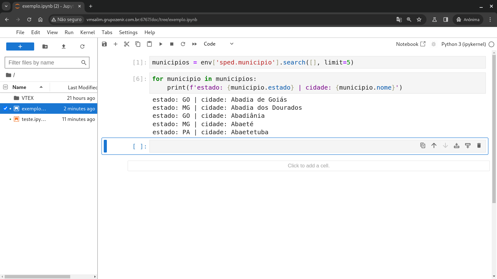

# jupyter_odoo

## Sobre

Este repositório trata-se da utilização do ["odoo-bin shell"](https://www.odoo.com/documentation/17.0/developer/reference/cli.html?highlight=conf#shell)
a partir do Jupyter. O [Jupyter](https://docs.jupyter.org/pt-br/latest/)
(Lab/Notebook) proporciona diversas experiências positivas, porém inicialmente
não é particularmente intuitivo iniciá-lo como ocorre no ipython. Portanto, os
passos abaixo servem de orientação para implantar sua utilização.

#### Utilização do jupyter


## IPython

O [IPython](https://ipython.readthedocs.io/en/stable/) é basicamente o kernel
padrão do jupyter, portanto o que for executado, instanciado ou pré carregado e
incluído em seu interpretador pode ser direcionado para o jupyter.

Sabendo disso, é necessário gerar um script de inicialização para o ipython onde
seja carregado todas as [configurações](https://www.odoo.com/documentation/17.0/developer/reference/cli.html?highlight=conf#reference-cmdline-config)
pŕe-configuradas no arquivo de configuração central do odoo, para então gerar
uma variável que retorne um ponteiro no banco de dados.

### 00_odoo.py

Ao acessar a árvore de diretório `.ipython/profile_default/startup` localizado
na `$HOME`, chegamos no diretório de inicialização do IPython. Ao acessar o
[README](https://github.com/ipython/ipython/blob/main/IPython/core/profile/README_STARTUP)
é possível compreender que os scripts de inicialização podem conter qualquer
nomenclatura, desde que inicie com numerais onde possam identificar sua
sequência.

#### Vamos ao código

##### Imports

```python
import odoo

from pathlib import os, Path
from odoo.tools import config
```

##### Acessando diretório das configurações
```python
# Obtém caminho absoluto do diretório de configurações
diretorio = Path(Path().home(), Path('jupyter/.config'))

# Acessa diretório
os.chdir(diretorio)
```

##### Carregando configurações
```python
# Parâmetros para config
args = ['-c', '.odoo.conf', '--load-language=pt_BR']

# Carrega configurações do config
config.parse_config(args)
```

##### Obtendo ponteiro do banco
```python
# Gerenciador de contexto para um conjunto de ambientes.
with odoo.api.Environment.manage():
    # Captura o registro do modelo do banco.
    registry = odoo.registry(config.get('db_name'))

    # Retorne um novo cursor para o banco de dados.
    cr = registry.cursor()

    # PID do superusuário
    uid = odoo.SUPERUSER_ID

    # Captura o contexto da localização
    ctx = odoo.api.Environment(cr, uid, {})['res.users'].context_get()

    # Instância do banco em 'Environment object'
    env = odoo.api.Environment(cr, uid, ctx)
```

> 1ª Nota: Ao iniciar o ipython esse script será executado e a variável `env`
> vai estar disponível no escopo.

> 2ª Nota: O path do ipython ao ser executado é o diretório onde foi chamado,
> portanto o arquivo de configuração (odoo.conf) deve estar no diretório em
> questão.

<a name="nota" id="nota_odoo_conf"></a>

> 3ª Nota: O arquivo `odoo.conf` foi ocultado com o ponto inicial visando a
> usabilidade com jupyter que será explicada posteriormente.

## Jupyter

### Trabalhando remotamente

> __Caso não vá trabalhar de forma remota com o jupyter avance para o próximo__
> __[tópico](#criando-diretório-baseconfig)__.

Caso seja o seu caso manter o jupyter em um servidor ou vm, temos que gerar o
arquivo de configurações do jupyter lab e/ou notbook. Para isso, vamos gerar
respectivamente as configurações com `jupyter-lab --generate-config` e/ou
`jupyter-notebook --generate-config`.

Os arquivos gerados estarão na `$HOME` dentro de `.jupyter` com os respectivos
nomes: `jupyter_notebook_config.py` e/ou `jupyter_notebook_config.py`.

> Nota: Ambas as configurações são aplicadas igualmente.

Com os arquivos gerados, teremos uma varável `c` que recebe o `get_ipython()`,
que por sua vez nada mais é do que um método que recebe parâmetros de execução e
os atribui para o __interpretador do ipython__.

##### Com a variável pré definida, temos apenas que parametrizar duas situações:

* 1º - Setar o __endereço de conexão__:
    * c.ServerApp.ip = '192.168.100.10'.
* 2º - Permitir inicialmente que qualquer um __acesse o servidor__:
    * c.ServerApp.allow_origin = '*'.
* 3º - Carregamento automático do __kernel python__:
    * c.LabServerApp.notebook_starts_kernel = True.
* 4º - Habilitando o __autoreload__:
    * c.ServerApp.autoreload = True.
* 5º - Impede abertura de __browse__:
    * c.ServerApp.open_browser = False.
* 6º - Define __porta padrão__:
    * c.ServerApp.port = 6767.
* 7º - Define __diretório padrão__:
    * c.ServerApp.root_dir = 'jupyter'.

> Nota: As alterações acima possibilitam a conexão externa de qualquer pessoa ao
> jupyter com endereço fictício: __192.168.100.10__.

### Criando diretório base/config
É necessário criar um diretório base para armazenar os notebooks gerados. Para
isso vamos criar um diretório nomeado como `jupyter` em `$HOME` com
`mkdir -p $HOME/jupyter/.config`.

### Gerando link simbólico
Agora vamos gerar um link simbólico do odoo.conf mencionado na
[3ª Nota](#nota_odoo_conf) de
[Obtendo ponteiro do banco](#obtendo-ponteiro-do-banco).

Ao iniciarmos o jupyter teríamos que estar no diretório de configuração do odoo
para que o [00_odoo.py](#00_odoopy) possa capturar as configurações de de
odoo.conf. Para contornar essa limitação iremos gerar um link simbólico oculto
no diretório default do jupyter com:
`ln -s ~/odoo/odoo.conf ~/jupyter/.config/odoo.conf`.

Com o link simbólico gerado no diretório `~/jupyter/.confi` será possível
iniciar o jupyter lab/notebook sem problemas.

### Autenticação com senha
___
Como foi [dito anteriormente](#com-a-variável-pré-definida-temos-apenas-que-parametrizar-duas-situações),
as conexões externas estão liberadas para qualquer um com acesso a rede. Para
contornar essa situação podemos gerar uma senha de autenticação gerada e
gerenciada pelo próprio jupyter.

Para gerar-la é necessário executar o comando
`jupyter-lab/jupyter-notebook password` e em seguida inserir/confirmar a senha.

### Início automático
Bom, não consegui fazer com que a inicialização do jupyter através do `systemd`
instâncias se com êxito o ponteiro do banco representado pela variável `env`.

Portanto, foi utilizado apenas o `screen` em uma seção nomeada para isso, sendo
o controle de quantidade de sessões realizado via _shell script_.

```zsh
# Entrar caso o número de sessões nomeadas como "jupyter_sessao" seja 0 e inicia
# uma nova instância da mesma
if [ $(screen -ls|grep "jupyter_sessao"|wc -l) -eq 0 ]; then
    screen -dmS jupyter_sessao zsh -c 'jupyter-lab'
fi
```

## Conclusão
Agora é possível utilizar o `odoo-bin shell` pelo Jupyer Lab/Notebook.
